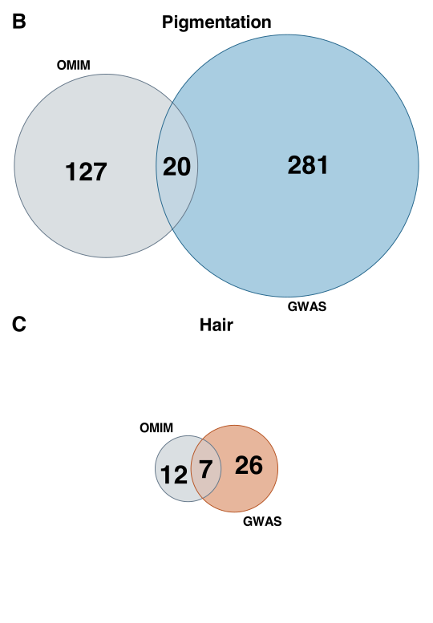

Analysis accompanying Figure 3 of *Classical foundations and genomic advances in human pigmentation and hair morphology*.

Yemko Pryor, Lily Heald, and Tina Lasisi

## Gene sets

<!-- counts:start -->

| Trait group | OMIM only | Both sources | GWAS only | Total |
|---|---:|---:|---:|---:|
| Pigmentation | 127 | 20 | 281 | 428 |
| Hair | 12 | 7 | 26 | 45 |

The groups share 14 gene names: **459 distinct names** across **473 gene–trait rows**. Between-group overlap differs from OMIM/GWAS overlap within each group.

<!-- counts:end -->

GWAS sets require at least **two distinct papers per gene and trait group**. Hair includes scalp, facial, and body traits; hair color and graying join pigmentation. See [methods](methods.qmd) and [gene evidence](genes.qmd).

## Scope

These counts describe the compiled resources. GWAS mapped genes are association annotations, not causal assignments. The October 3, 2026 responses define the analyzed snapshot.
